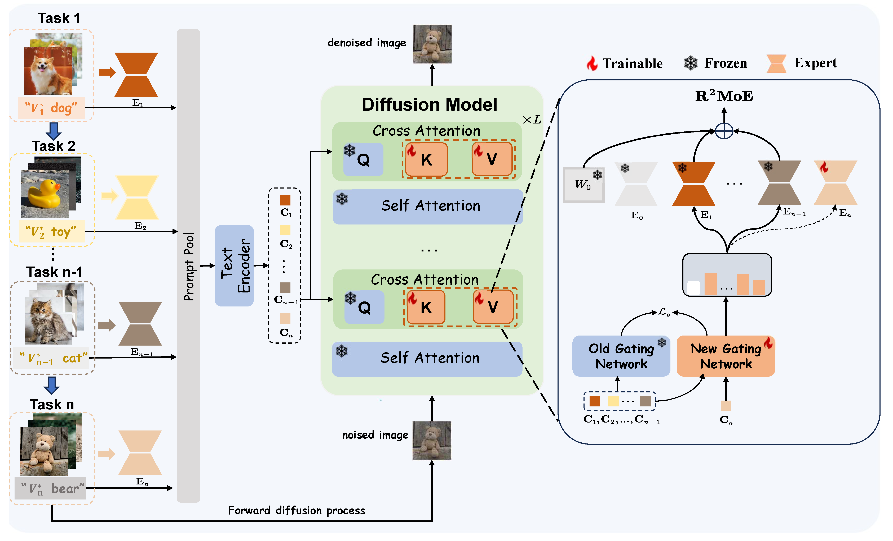

# :page_with_curl: R<sup>2</sup>MoE: Redundancy-Removal Mixture of Experts for Lifelong Concept Learning

This is the *Pytorch Implementation* for the paper:

> **R<sup>2</sup>MoE: Redundancy-Removal Mixture of Experts for Lifelong Concept Learning** <br><br>
>

> **Abstract**:  

<div align=center>

</div>

## 🔧 Dependencies and Installation
**Depedencies**
* Python >= 3.8 (Recommend to use [Anaconda](https://www.anaconda.com/download/#linux) or [Miniconda](https://docs.conda.io/en/latest/miniconda.html))
* Pytorch 2.3 or later. See [Pytorch]( https://pytorch.org) for install instructions.
* Linux (Ubuntu 20.04.3)

**Installation**

First, you can clone this repo using the command:

```shell 
git clone https://github.com/learninginvision/R2MoE.git
```

Then, you can create a virtual environment using conda, as follows:

```shell
conda env create -f environment.yaml
conda activate R2MoE
```

## :floppy_disk: Data preparation
Get regularization data:
```shell
bash sample-continual-10task_reg.sh
```
you can get regularization image in the folder ./gen_reg
##  💻 Training
Run the following command to train the model sequentially:


```shell
bash scripts/finetune_gen_loramoe_continual.sh
```

After training, you can get model checkpoints in the folder `./logs/<your_model>/checkpoints`.

## 📊 Evaluation
After completing training, you can generate image by using the following command:

Inference
```shell
bash sample-continual_bbox-10task.sh
```
The result will be saved in the folder `./logs/<your_model>/reg`.

CLIP Metric calculation
```shell
bash scripts/evaluate_IA.sh
bash scripts/evaluate_TA.sh
```
Diversity calculation
```shell
python diversity.py --path ./logs/<your_model>/reg
```

## 📈 Results

<div align="center">


*Results of divesity.*
</div>

<div align="center">


*Results of CLIP TA, CLIP IA and forgetting.*
</div>
</div>

<div align="center">


*Diversity of image generation.*
</div>

## 📜 Acknowledgments

This code is built upon 

[1] [ldm](https://github.com/CompVis/latent-diffusion)

[1] [Attention Refocusing](https://github.com/Attention-Refocusing/attention-refocusing)


We thank the authors for releasing their code.
