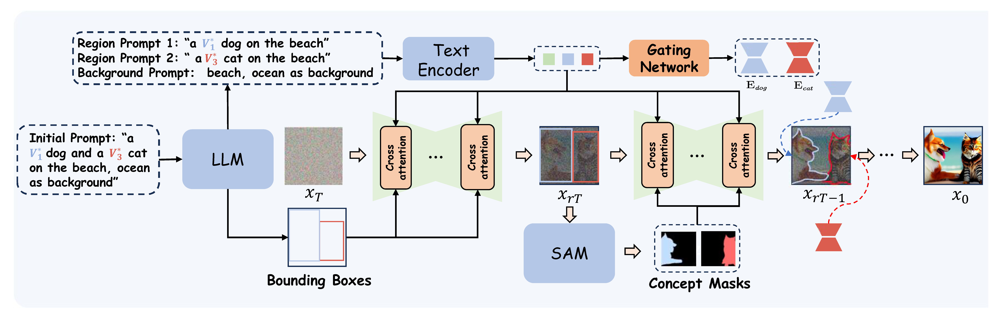

# :page_with_curl: R<sup>2</sup>MoE: Redundancy-Removal Mixture of Experts for Lifelong Concept Learning 
### 
This is the *Pytorch Implementation* for the paper:
> [**R<sup>2</sup>MoE: Redundancy-Removal Mixture of Experts for Lifelong Concept Learning** <br><br>](https://arxiv.org/html/2507.13107v1)
>
 ## Overview
### Train Paradigm 
<div align=center>

</div>

### Inference Paradigm 
<div align=center>

</div>
[R<sup>2</sup>MoE](https://arxiv.org/html/2507.13107v1) enables continuous learning of new concepts (up to hundreds) on a pre-trained diffusion model without significant catastrophic forgetting. This approach also reduces the additional storage required for each new concept to 0.6MB.
Our method also supports the compositional application of multiple concepts.

## 📈 Results

### Single-Concept Results
<div align="center">

</div>

### Multi-Concept Results

</div>
<div align="center">


</div>

## 🔧 Dependencies and Installation
**Depedencies**
* Python >= 3.8 (Recommend to use [Anaconda](https://www.anaconda.com/download/#linux) or [Miniconda](https://docs.conda.io/en/latest/miniconda.html))
* Pytorch 2.3 or later. See [Pytorch]( https://pytorch.org) for install instructions.
* Linux (Ubuntu 20.04.3)

**Installation**

First, you can clone this repo using the command:

```shell 
git clone https://github.com/learninginvision/R2MoE.git
```

Then, you can create a virtual environment using conda, as follows:

```shell
conda env create -f environment.yaml
conda activate R2MoE
```

## :floppy_disk: Data preparation
Get regularization data:
```shell
bash sample_reg_dataset.sh
```
you can get regularization image in the folder ./gen_reg
##  💻 Training
Run the following command to train the model sequentially:


```shell
bash scripts/finetune_gen_r2moe_continual.sh
```

After training, you can get model checkpoints in the folder `./logs/<your_model>/checkpoints`.

## 📊 Evaluation
After completing training, you can generate image by using the following command:

Inference
```shell
bash sample_single_concept.sh
```
The result will be saved in the folder `./logs/<your_model>/reg`.

If you want to generate image with multiple concepts, you can use the following command:
```shell
bash sample_single_concept.sh
```

CLIP Metric calculation
```shell
bash scripts/evaluate.sh
```
## References

```
@article{guo2025r,
  title={R\^{} 2MoE: Redundancy-Removal Mixture of Experts for Lifelong Concept Learning},
  author={Guo, Xiaohan and Cai, Yusong and Liu, Zejia and Wang, Zhengning and Pan, Lili and Li, Hongliang},
  journal={arXiv preprint arXiv:2507.13107},
  year={2025}
}
```


## 📜 Acknowledgments

This code is built upon 

[1] [ldm](https://github.com/CompVis/latent-diffusion)

[2] [Custom Diffusion](https://github.com/adobe-research/custom-diffusion)

We thank the authors for releasing their code.
